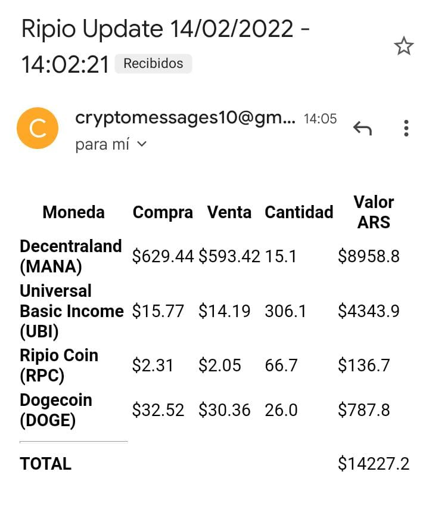

# CRIPTO INFO WALLET RIPIO

Aplicación informativa sobre las cotizaciones en tiempo real sobre tus criptomonedas alojadas en la wallet de Ripio, realizada en NodeJS, consumiendo la API de Ripio para acceder a la wallet personal, web scrapping para las cotizaciones y nodemailer para los avisos al usuario.  

# EMAIL DE EJEMPLO:

# CONSIDERACIONES

- Debes obtener tu key personal en la documentacion de la API de RIPIO y colocarla dentro del modulo request.js
- Colocar correo que envia el mail dentro del modulo nodemailer.js
- Debes colocar la direccion de correo electronico receptora, en el caso de ser mas de una separarlas con comas ej: 'mail1@gmail.com,mail2@gmail.com,mail3@gmail.com'

(es buena practica tener todos estos datos sensibles en un file .env y llamarlas en los modulos como variables de entorno)

